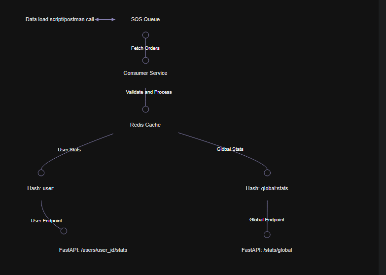

# **SQS Queue Order Processing Pipeline**

## **Project Overview**
This project demonstrates a data pipeline for a  platform where order events are ingested, processed, aggregated, and cached for fast retrieval. It includes:
- **Event Ingestion**: From a simulated SQS queue.
- **Data Transformation**: Validation, aggregation, and cleanup.
- **Caching**: Redis as the caching layer for user and global statistics.
- **REST API**: Exposing endpoints for quick retrieval of stats using FastAPI.
- **Gen AI**: Gen AI integration to perform data quality checks.

---

## **Tools Used**
- **FastAPI**: REST API framework.
- **Redis**: In-memory data store for caching.
- **Localstack**: Simulates AWS SQS for local development.
- **Docker & Docker Compose**: Containerization and service orchestration.
- **AWS Cli**: Configuring and creating queue.

---

## **Setup Instructions**
### **Prerequisites**
1. **Docker & Docker Compose**:
   - Download from [Docker Official Website](https://www.docker.com/get-started).
2. **Python** (3.8+):
   - Download from [Python Official Website](https://www.python.org/downloads/).
3. **AWS CLI**:
   - Install using [AWS CLI Installation Guide](https://docs.aws.amazon.com/cli/latest/userguide/getting-started-install.html).

### **Steps to Set Up the Project**
1. Clone the repository:
   ```bash
   git clone https://github.com/Aftabbs/SQS-py-pipeline-DE-Assignment.git
   cd <repository-folder>
   ```

2. Start services using Docker Compose:
   ```bash
   docker-compose up
   ```

3. Populate the SQS queue with sample data:

**NOTE**: Ensure the source file relative path is properly provided  to this script file

   ```bash
   python scripts/populate_sqs.py
   ```

4. Verify worker processing:
   - Confirm worker logs for successful ingestion and Redis updates.

5. Test API Endpoints:
   - **User stats**: 
     ```bash
     curl http://localhost:8000/users/U5683/stats
     ```
   - **Global stats**:
     ```bash
     curl http://localhost:8000/stats/global
     ```


---

## **Repository Contents**
- **`scripts/`**:
  - `populate_sqs.py`: Adds sample data to SQS Queue.
- **`project/`**:
  - `api/api.py`: FastAPI application.
  - `consumer/consumer.py`: SQS consumer.
- **`enhancement/enhancement.py`**:
  - Optional enhancements: Top N users, date range filters.
- **`docker-compose.yml`**: Service orchestration.

---

### **Task 3: Design Reasoning**
#### Data Models & Approach:
1. **Redis Hash for User Stats**:
   - Key: `user:<user_id>`, Fields: `order_count`, `total_spend`.
   - Efficient for individual lookups.
2. **Redis Hash for Global Stats**:
   - Key: `global:stats`, Fields: `total_orders`, `total_revenue`.
   - Simplifies global data aggregation.


---

#### Additional Enhancements:
   - Horizontal scaling using multiple workers with k8s.
   - Employ Redis clustering for distributed caching.
   - Utilizing Kafka for parallel processing.
   

---

### Design Diagram

